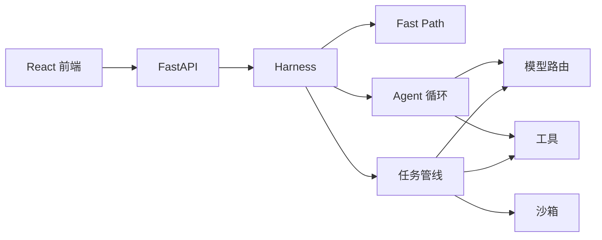
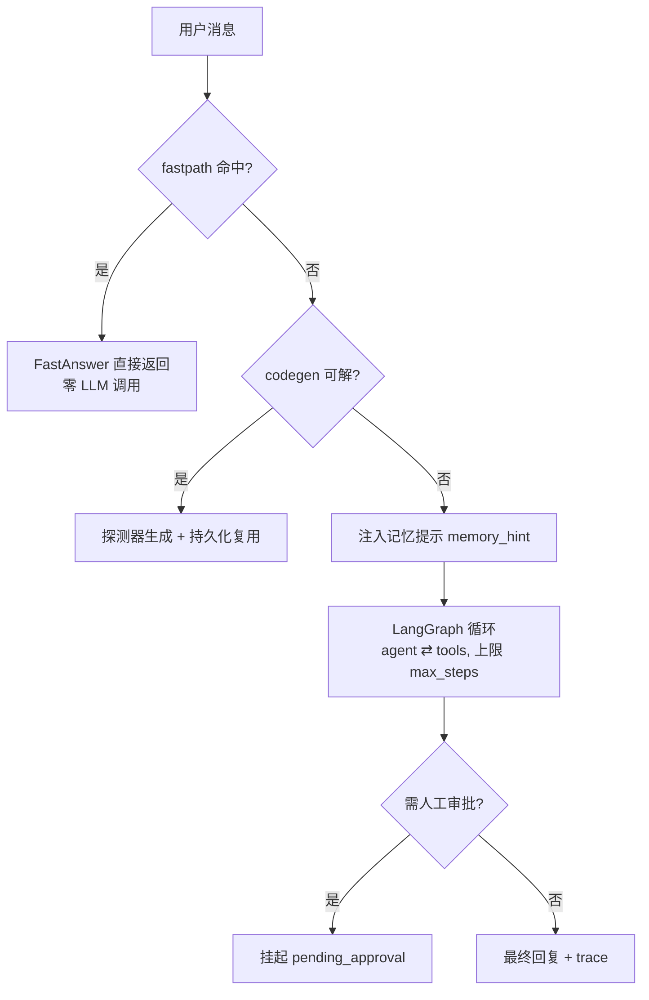
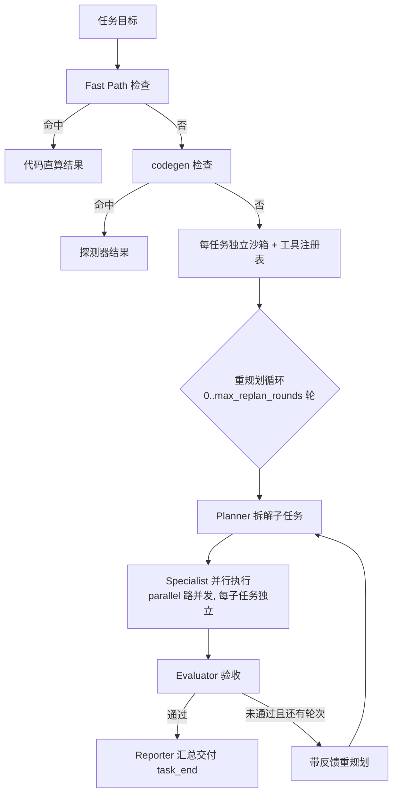

# agentpulse 架构文档

> agentpulse 是一个本地优先、单仓可控的 AI Agent Harness：FastAPI + LangGraph + LiteLLM 后端，React/TS 前端。
> 核心设计哲学：**能用代码 100% 确定答案的就不调用模型**（Fast Path），复杂度按需升级。

---

## 1. 设计原则

| 原则 | 说明 |
|---|---|
| **三层执行，按需升级** | 零模型 Fast Path → 单 Agent 循环 → 多角色任务管线，复杂查询才进入重编排 |
| **代码直算优先** | 算术/时间/换算等确定性任务由代码解决，LLM 不做它不擅长的计算 |
| **聊天/任务模型分离** | 聊天模型与任务模型是独立配置域，互不干扰，另有会话级覆盖 |
| **可观测性原生** | Agent 拓扑图、任务事件流、Fast Path 标记、token 计量全程可视化 |
| **本地优先、零云依赖** | SQLite + 本地沙箱 + `.env` 密钥，数据与密钥不出本机 |
| **安全白名单** | 表达式求值用 AST 白名单，沙箱路径做边界校验，密钥不进 git |

### 术语约定（先读，避免混淆）

- **插件 / 探测器插件**：特指 **Fast Path 探测器规则包**（`触发词 → detect(text) → 答案` 的确定性函数），用于「免模型应答」。UI 的「插件」Tab、`/api/plugins` 路由即管理它。**与 deepseek-harness 那种「架构级插件」（Cordis 插件、整个系统由插件组合）完全是两回事**。
- **工具**：注册在 `ToolRegistry` 上的可调用函数（带 schema），由模型通过 `tool_calls` 决定是否调用。与插件机制不同：**插件在模型之前拦截（零模型），工具在模型之后被调用**。
- 三个来源的探测器：内置核心（`fastpath.py` 内置 matcher）→ promoted（合并进 `generated_detectors.py`）→ 运行时探测器（`data/` 下加载）。

## 2. 系统总览



## 3. 核心执行路径

### 3.1 一条聊天消息的旅程（`harness.run()`）



- **Fast Path**（`fastpath.py`）：依次尝试 7 个内置 matcher —— `arithmetic → statistics → unit_convert → date_math → base_convert → text_stats → time`，然后 promoted 探测器、沙箱查询、运行时探测器。命中即返回，`last_steps=1`，trace 标记「代码直算」。
- **codegen**（`codegen.py`）：让模型写一个探测器函数，验证通过后**持久化为探测器规则**（UI「插件」Tab 可见），同款问题此后零模型。
- **LangGraph 循环**（`graph/loop.py`）：`START → agent ⇄ tools → END`（含 `human_gate` 审批分支），`max_steps` 防失控。
- 聊天模式 `session_history=False`：只送当前消息 + 记忆提示，跨轮知识靠长期记忆（`remember`/`recall` + 自动预取）。

### 3.2 一条任务的旅程（`tasks.py TaskRunner._run`）



- **Planner / Evaluator / Reporter**（`roles.py`）为单次调用，**Specialist** 为工具循环（步数上限 `max_steps`）。
- 并行扇出用 `ThreadPoolExecutor(max_workers=min(parallel, total))`，结果按索引归位保序。
- 全程事件流经 SSE（`/api/tasks/{id}/stream`）推送：`task_start / plan / subtask_start / thought / tool_call / tool_result / evaluation / re_plan / task_end / error`。

## 4. 模型路由（`llm.py LiteLLMRouter`）

### 4.1 模型库与别名解析（`_resolve`）

- 模型名可以是**模型库别名**（`config.json → models`，如 `sensenova-deepseek`）或裸模型名。
- 命中别名 → 取 profile 的 `model` / `base_url` / `api_key_env`；`api_key_env` 三态：**空 → .env 默认密钥**、**环境变量名 → 取 `os.environ`**、**裸密钥 → 原样使用**。
- 自定义 `base_url` 且模型名无厂商前缀（无 `/`）时自动补 `openai/`（litellm 需要 provider 前缀）。

### 4.2 聊天 / 任务模型分离

| 域 | 配置 | 空值回退 |
|---|---|---|
| **聊天模型** | `config.json → default_model`（`runner.router.settings.model`） | `.env` 的 `LLM_MODEL`（`router.env_model`） |
| **任务模型** | `config.json → agent_models[phase]`（Planner/Specialist/Evaluator/Reporter） | `.env` 基线（**不**跟随聊天模型） |

- `TaskRunner._task_model(phase) = agent_models[phase] or router.env_model`。
- 会话级覆盖：`/api/chat` 带 `model` → `harness.run(model=)` → 注入 LangGraph state → agent 节点 `state.get("model") or loop 默认`，只对本 turn 生效。

### 4.3 Provider-scoped 重试（`RetryPolicy`）

- `RetryPolicy`：`max_retries / backoff_base / retry_on / wait()`，指数退避。
- `_policy_for(api_base)` 按网关自动升级：低配额网关（如 `sensenova`）→ **4 次重试、2s 起退避（2/4/8/16s）**；默认 3 次 / 1.5s。
- `complete()` 关闭 litellm 自带重试（`num_retries=0`），统一走策略，避免双重退避。
- 所有调用路径（聊天、任务角色、codegen）共用同一路由与重试。

## 5. 记忆系统（`memory/`）

| 组件 | 说明 |
|---|---|
| `ShortTermMemory` | 会话转录（上限 `short_term_max`），聊天显示用 |
| `LongTermMemory` | SQLite 事实库，暴露为 `remember` / `recall` 工具，多 scope |
| `memory_hint()` | 机制级预取：按 key 与输入的重叠（2-gram）把命中快照注入系统提示，模型无需主动 recall 就「知道」 |

任务侧只读不写长期记忆（`recall` 可用，`remember` 禁用），任务数据活在沙箱文件里。

## 6. 工具注册表与审批（`tools/`）

- `ToolRegistry`：内置工具集（`builtin.py`：时间、记忆、fetch、文件读写、算术等），聊天暴露子集（`CHAT_TOOL_NAMES`），任务用完整集。
- 审批门：`require_approval=True` 的工具走 `human_gate` 节点（interrupt + resume），前端弹出审批卡片。
- `registry.schemas()` 生成 OpenAI 工具 schema 供 litellm。

## 7. 沙箱

- 单目录沙箱（`data/sandbox/`），每任务独立子目录 + 独立工具注册表（并行安全）。
- 文件读/写/删做路径边界校验（`resolve()` + `is_relative_to`），禁止越界。
- 预览区分文本 / 图片 / PDF / CSV / Markdown / JSON / 代码，HTML 用 iframe 隔离渲染。

## 8. 配置模型（`data/config.json`）

```jsonc
{
  "parallel": 4,                // Specialist 并行扇出
  "max_replan_rounds": 1,       // Evaluator 打回重规划轮数
  "max_steps": 10,              // Specialist 工具循环步数上限（聊天循环同用）
  "agent_models": {},           // 任务模型：planner/specialist/evaluator/reporter
  "default_model": "",          // 聊天模型（空 = .env LLM_MODEL）
  "models": {}                  // 模型库：{alias: {base_url, model, api_key_env}}
}
```

- 字段级更新：`PUT /api/config` 只更新请求显式携带的字段，未变字段保留磁盘现值（前端逐字段 diff 提交）。
- `data/` 与 `.env` 均在 `.gitignore`，密钥不落版本库。

## 9. API 路由（`api.py`）

| 分组 | 路由 |
|---|---|
| 健康/状态 | `GET /api/health` `GET /api/state` |
| 聊天 | `POST /api/chat` `GET /api/chat/history` `DELETE /api/chat/history` `POST /api/chat/approve` |
| 任务 | `POST /api/tasks` `GET /api/tasks` `GET /api/tasks/{id}` `GET /api/tasks/{id}/stream`(SSE) |
| 配置 | `GET /api/config` `PUT /api/config` |
| 记忆 | `GET/POST/DELETE /api/memories` `POST /api/reset` |
| 工具/Agent | `GET /api/tools` `GET /api/agents` |
| 事件日志 | `GET /api/events?scope=chat\|task&ref=&limit=`（回放/recent/refs） |
| 探测器/示例 | `GET /api/plugins` `DELETE /api/plugins/{name}` `POST /api/plugins/promote` `GET /api/examples` `POST /api/examples/regenerate` `POST /api/examples/delete` |
| 沙箱 | `GET /api/sandbox` `GET /api/sandbox/raw` `GET /api/sandbox/content` `PUT /api/sandbox/content` `DELETE /api/sandbox/file` `DELETE /api/sandbox` |

## 10. 前端（`web/`，React + Vite + TS）

- 8 个 Tab：聊天 / 任务 / 历史 / 插件（探测器管理）/ 工具 / Agent / 沙箱 / 设置，`chat-main` 区域滚动、顶部 Tab 固定、右侧 Memory 独立滚动。
- **Agent 图**（`AgentsPanel`）：SVG 拓扑图渲染任务管线，节点可点击（Fast Path 弹窗、工具、探测器），循环/错误边、统计行与模型标签可交互。
- **任务流**（`TaskPanel`）：SSE 实时渲染事件分组卡片 + 子任务迷你循环图 + 产出文件预览。
- **沙箱**（`SandboxPanel`）：类型过滤（图片/文档/代码/其他 + 计数）、文本/图片/PDF/CSV/JSON 预览与编辑。
- **设置**（`SettingsPanel`）：模型库 + 聊天/任务模型 + 运行参数，600ms 防抖自动保存（字段级 diff），顶栏模型标签实时刷新。

## 11. 目录结构

```
src/agentpulse/
  api.py          # FastAPI 应用工厂 + 全部路由
  harness.py      # 组合根：Settings/Router/记忆/工具/Loop
  llm.py          # LiteLLMRouter：模型解析、RetryPolicy、token 计量
  fastpath.py     # Fast Path matcher（AST 白名单求值）
  codegen.py      # 探测器生成 + 规则持久化（UI「插件」Tab）
  tasks.py        # TaskRunner：任务管线、并行、重规划、历史持久化
  roles.py        # Planner / Evaluator / Reporter
  graph/          # LangGraph 循环（loop/state）
  memory/         # ShortTerm / LongTerm（SQLite）
  tools/          # ToolRegistry + 内置工具（builtin/fs/http）
  config.py       # Settings（.env 驱动）
  chat_history.py # 聊天历史存储
  generated_detectors.py  # 已提升（promoted）探测器
web/src/
  App.tsx         # 布局 + Tab 路由 + 记忆侧栏 + 模型标签
  api.ts          # 前端 API 客户端
  components/     # 各 Tab 面板
  index.css       # 主题变量 + 布局
data/             # config.json / sandbox / 记忆 SQLite（gitignore）
```

## 12. 安全与隐私

- **表达式求值**：AST 白名单（数字常量 / 二元运算 / 一元正负号），绝不 `eval` 任意代码。
- **沙箱边界**：路径解析后 `is_relative_to` 校验，禁止逃逸。
- **密钥**：`.env` + `data/` gitignore；API Key 支持环境变量名 / 裸密钥，前端 `type=password` 掩码。
- **审批门**：高危工具（写文件等）调用需人工确认，默认拒绝。
- **HTML 渲染**：预览用 iframe 隔离，Markdown 经 `marked` 转义处理。

## 13. 已记录的关键设计决策

- Fast Path 自举：Agent 生成探测器 → 成功即持久化复用（`docs/plan-human-in-the-loop.md` 旁的 ADR 族）。
- **事件日志持久化**（`event_log.py`）：聊天/任务事件逐条实时落库（scope=chat/task，ref=thread/task id），运行中/失败也留档；`GET /api/events` 支持回放、recent、refs 列表——事件可审计、可跨重启续接，是对 dsh 事件溯源思路的轻量落地（不引框架，图驱动保持不变）。
- 聊天/任务模型分离：避免「全局默认」语义歧义，两个独立配置域。
- 字段级配置更新：防止 UI 全量提交覆盖磁盘上外部修改。
- Provider-scoped 重试：低配额网关（sensenova.cn）自动升级退避策略。
- 区域滚动布局：顶部 Tab 固定、主区独立滚动、Memory 侧栏独立滚动。
